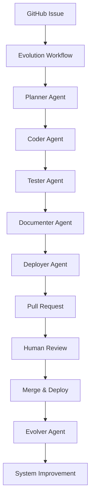

# AI Seed Repository

Welcome to the AI Seed Repository - a revolutionary self-evolving application framework powered by AI agents.

## What is AI Seed?

AI Seed is a comprehensive boilerplate repository that creates applications capable of autonomous evolution through AI agent collaboration. When you submit a GitHub issue describing desired functionality, specialized AI agents automatically:

- 📋 **Plan** the implementation approach
- 💻 **Code** the solution following best practices
- 🧪 **Test** with comprehensive coverage
- 📚 **Document** all changes
- 🚀 **Deploy** the updates
- 🔄 **Learn** from the outcomes

## Key Features

- **Autonomous Development**: AI agents handle 80% of development tasks
- **Human Oversight**: All changes go through PR review process
- **Multi-Agent Collaboration**: Specialized agents work together using CrewAI
- **Issue-Driven Evolution**: Simple GitHub issues trigger complete implementations
- **Continuous Learning**: System improves its own capabilities over time
- **Production Ready**: Full CI/CD, testing, documentation, and deployment

## Architecture Overview



## Quick Start

1. **Clone the Repository**
   ```bash
   git clone https://github.com/your-username/ai-seed-repo
   cd ai-seed-repo
   ```

2. **Configure Environment**
   ```bash
   cp .env.example .env
   # Edit .env with your API keys
   ```

3. **Install Dependencies**
   ```bash
   pip install -r requirements.txt
   ```

4. **Start the Application**
   ```bash
   python src/main.py
   ```

5. **Trigger Evolution**
   - Create a GitHub issue using the evolution template
   - Watch agents automatically implement your request
   - Review and merge the generated pull request

## Agent Roles

### 🎯 Planner Agent
- Analyzes evolution requests
- Creates comprehensive implementation plans
- Identifies dependencies and risks

### 💻 Coder Agent
- Generates high-quality, maintainable code
- Follows project patterns and conventions
- Implements comprehensive error handling

### 🧪 Tester Agent
- Creates exhaustive test suites
- Ensures high code coverage (95%+)
- Tests edge cases and error conditions

### 📚 Documenter Agent
- Updates all relevant documentation
- Generates API documentation from code
- Maintains user guides and examples

### 🚀 Deployer Agent
- Manages deployment configurations
- Updates infrastructure as needed
- Ensures smooth rollout processes

### 🔄 Evolver Agent
- Analyzes outcomes and performance
- Improves agent prompts and capabilities
- Evolves the system architecture

## Evolution Examples

Here are some example evolution requests:

- **"Add user authentication with JWT"** → Complete auth system with login, registration, and middleware
- **"Implement rate limiting"** → Rate limiting middleware with Redis backend and configuration
- **"Add database integration"** → SQLAlchemy models, migrations, and CRUD operations
- **"Create admin dashboard"** → Full admin interface with user management

## Technology Stack

- **Language**: Python 3.12+
- **Web Framework**: FastAPI
- **AI Framework**: CrewAI
- **LLMs**: OpenAI GPT-4o or Anthropic Claude
- **Testing**: Pytest with comprehensive coverage
- **Documentation**: MkDocs with Material theme
- **CI/CD**: GitHub Actions
- **Containerization**: Docker
- **Memory**: Pinecone or FAISS for agent memory

## Contributing

While this repository evolves autonomously, human contributions are welcome:

1. Submit evolution requests via GitHub issues
2. Review agent-generated pull requests
3. Provide feedback on implementations
4. Contribute to agent prompts and configurations

## Monitoring and Observability

- **Real-time Logs**: Comprehensive logging of all agent activities
- **Metrics Dashboard**: Track evolution success rates and performance
- **Health Checks**: Application and agent health monitoring
- **Evolution History**: Complete audit trail of all changes

## Security and Safety

- **Human Approval**: All changes require PR review
- **Security Scanning**: Automated vulnerability checks
- **Rollback Capability**: Easy reversion of problematic changes
- **Sandboxed Execution**: Agents operate in controlled environments

## Getting Help

- 📚 [Full Documentation](https://your-username.github.io/ai-seed-repo)
- 🐛 [Report Issues](https://github.com/your-username/ai-seed-repo/issues)
- 💬 [Discussions](https://github.com/your-username/ai-seed-repo/discussions)
- 📧 [Contact](mailto:your-email@domain.com)

## License

MIT License - see [LICENSE](LICENSE) for details.

---

**Ready to experience autonomous software evolution? Create your first evolution request and watch the AI agents bring your ideas to life!**
